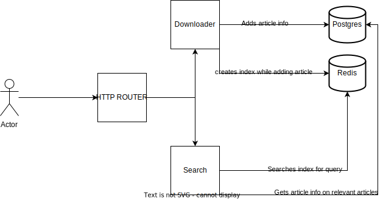

# xeldaChallenge


# To build and run

This will build the containers and deploy them running locally
`docker-compose up --build`

Hitting this endpoint in your browser/postman/curl will populate the database with 200 articles per hit, so it may take a while
`http://localhost:8080`


To Search: 
`localhost:8080/search?query=James+in+USA+america`
where the query you're searching for is `+` separated string

output:
```
[
  {
    "article": {
      "id": "159",
      "title": "Luna Rossa Challenge - Wikipedia",
      "link": "https://en.wikipedia.org/wiki/Luna_Rossa_Challenge"
    },
    "rank": 3
  },
  {
    "article": {
      "id": "12",
      "title": "Ricochet! - Wikipedia",
      "link": "https://en.wikipedia.org/wiki/Ricochet!"
    },
    "rank": 2
  },
  {
    "article": {
      "id": "63",
      "title": "Afrikaans Wikipedia - Wikipedia",
      "link": "https://en.wikipedia.org/wiki/Afrikaans_Wikipedia"
    },
    "rank": 2
  }
]
```

rank is how relevant the article is higher the better.

# Simple diagram



# How index works

Searching every document every time would be really slow so ill be creating an index (inverted index) to speed things up.

It will be a map of tokens (words eg. james) and values of the ids of the articles that contain it.

This way when i get a query, `james ireland`, i only search those two tokens and get a list of relevant articles in O(1) time (or O(N) where n is number of words in query string)

I then rank articles based on the frequency they appear in the return of the index. (this isnt great but it was really quick, ill mention other methods for ranking)

## Building index

I first remove the stopwords these are works like `I the in` this arnt super important in finding the context of what youre searching for.

I then tokenise the article, so `hello world` becomes `[hello,world]`

I convert everything to lowercase (case shouldnt really matter and it simplifies things)

I then build the index adding the article id for each token in redis.

This happens for each article as its added youll end up with an index something like this (i used one long string, really should have used an array of ints but redis was giving me trouble so i was just being quick):
 
Note this is in redis not in memory on the node
```
index = {
    "james": [1],
    "ireland": [1, 2],
    "hello": [1,5,6,7,9],
    "world": [1],
}

```

You can see hello is in a lot of.


# The Good Bad and Ugly


* No input validation was done this is a big no no
* Returning errors from db ect is terrible but made deving this quicker in prod returning generic errors and logging relevant ones
* Many more steps could have been used building the index eg stemming fuzzing etc
* That for loop to build the db wouldnt happen thats so you can test this faster.
* Could have used pagination on return in the return is large
* Used redis as it can persist to disk the index 
* should have made interfaces for dbs for mocking and testing
* created two db connections for both postgres and redis, this was because i was in a rush, could have just created the connecting in main and passed it along
